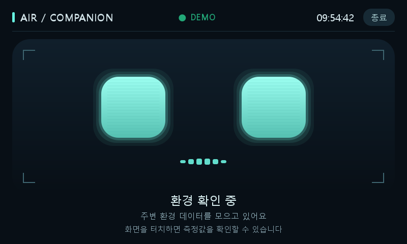
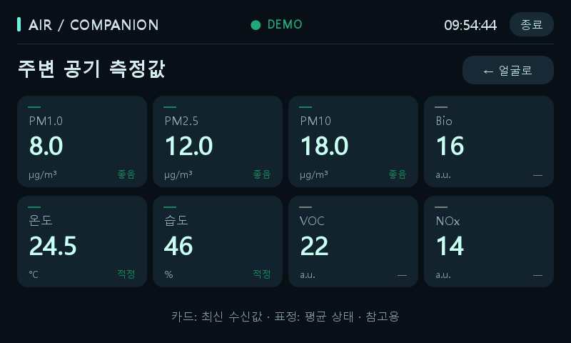

# Air Quality Robot Display — V2 UI Animation / WIP

800×480 Qt 화면에서 주변 환경을 로봇 표정과 8개 센서 카드로 표시하는 Python 프로젝트입니다. 실제 로봇 이동이나 공기청정 장비를 제어하지 않습니다.

## 주요 기능

- QPainter 로봇 얼굴과 Qt 센서 카드, 홈/상세 화면 전환
- PM1.0, PM2.5, PM10, VOC, NOx, Bioaerosol, 온도, 습도 표시
- PM 3종과 온습도의 최근 30초 이동평균, 최소 24개 sample, 후보 상태 10초 확인
- 짧은 수신 오류 허용, stale 표시, worker 취소와 재연결
- VOC/NOx/Bio는 표시 전용이며 종합 표정에서 제외
- 데모 모드, 종료 처리, 중복 실행 방지, systemd watchdog 지원

상세 카드는 최신 수신값, 얼굴은 평균과 확정 결과를 표시합니다. 센서 대기 중 상세 진입은 차단됩니다. 공식 AQI나 건강 안전 판정이 아닙니다. 판정 근거는 [SENSOR_CRITERIA.md](SENSOR_CRITERIA.md)를 참고하세요.

## 기술 스택

Python, PySide6(Windows 개발), PySide2/Qt 5(기존 Raspberry Pi 환경), QPainter, pySerial, unittest.

### V1 화면 호환성 보완

Pi의 Qt 5와 Windows Qt 6에서 헤더·상세·홈·종료 화면 및 바깥 여백을 어두운 배경으로 명시합니다. 각 컨테이너에 `WA_StyledBackground`를 적용했습니다. 헤더의 DEMO/연결 알림은 숨기고, 상세 화면 하단에는 갱신 경과시간·수신 지연 안내를 유지합니다. 분석 및 통신 기준은 변경하지 않았습니다. 배포 시 `dashboard.py`, `robot_ui.py`, `robot_led.py`를 함께 복사하세요. 실제 Pi 렌더링은 재확인이 필요합니다.

### V2 얼굴 애니메이션

V1의 센서 통신과 환경 판정은 유지하면서 QPainter 얼굴에 상태별 움직임을 추가했습니다. `robot_animation.py`는 경과시간에 따른 눈 위치, 눈 개방 정도, 입 파형과 상태 기호만 계산하고, `robot_ui.py`가 하나의 50ms Qt 타이머로 화면을 다시 그립니다. 얼굴 화면이 숨겨지면 해당 타이머도 정지합니다.

- `waiting`: 입 파형이 오른쪽으로 흐름
- `monitoring`: 눈이 좌우로 주변을 탐색
- `normal`: 일정 간격으로 눈을 깜빡임
- `detected`: 느낌표가 점멸
- `comfortable`: 눈이 위아래로 미세하게 이동
- `moving`: 방향 화살표와 시선이 좌우로 전환
- `purifying`: 좌우 공기 물결과 입 파형이 움직임

`moving`과 `purifying`은 표시 상태일 뿐 실제 이동이나 공기청정 장비를 제어하지 않습니다. `PURIFYING`은 향후 외부 상태 입력을 받을 수 있도록 표시용 API만 제공하며 현재 통신 프로토콜은 구현하지 않았습니다.

## 데모 실행

Windows PowerShell:

```powershell
python -m venv .venv
.\.venv\Scripts\python.exe -m pip install -r requirements.txt
.\.venv\Scripts\python.exe main.py --demo --windowed
```

공개본에는 실제 센서 프로토콜과 통신 값이 없습니다. 먼저 `--demo`로 실행하세요. 전체화면은 `--windowed`를 생략합니다. Linux에서는 해당 환경의 PySide2 또는 PySide6와 pySerial을 별도로 준비하세요. 기존 Raspberry Pi의 Python 3.7/PySide2 호환을 고려하지만 장비에서 직접 검증해야 합니다.

## 로컬 전용 센서 설정

없는 파일만 생성하고 기존 장비 설정은 덮어쓰지 않습니다.

```powershell
if (!(Test-Path sensor_protocol.py)) { Copy-Item sensor_protocol_template.py sensor_protocol.py }
if (!(Test-Path sensor_connection_local.py)) { Copy-Item sensor_connection_example.py sensor_connection_local.py }
```

- `sensor_protocol.py`: 실제 장비에 대해 승인된 로컬 구현을 넣습니다. 공개 예제는 함수/예외 인터페이스만 제공하며 패킷을 생성하거나 전송하지 않습니다. placeholder 값만 채워도 완성되는 구현이 아닙니다.
- `sensor_connection_local.py`: 실제 baudrate, 데이터 비트, 패리티, 정지 비트 등 장비 설정을 로컬에서 입력합니다.
- 실제 register address, slave/device ID, 요청/응답과 매핑 정보는 공개 저장소에 포함되지 않습니다.
- 기존 장비의 두 로컬 파일은 유지하세요. 배포 시 공유 코드와 로컬 설정이 함께 필요합니다. Git clone/pull만으로 비공개 파일이 복원되지는 않습니다.
- `read_sensor_data(ser, cancel_event=None)`는 정상 프레임 전체 검증 후 센서 key의 dict를 반환해야 합니다. CRC/프레임 오류를 부분 성공으로 처리하지 않습니다.

## 검사

위 예제 복사 후 센서 없이 실행할 수 있습니다.

```powershell
.\.venv\Scripts\python.exe -m unittest discover -p "test_*.py"
.\.venv\Scripts\python.exe check_demo.py
```

테스트는 가짜 포트/데이터와 offscreen Qt를 사용합니다. 실제 장비 전용 패킷 테스트는 공개하지 않습니다. `check_demo.py`는 미리보기 PNG를 생성합니다.

## 공개 범위와 현재 상태

`.gitignore`는 검토한 파일만 공개하는 allowlist입니다. 새 파일을 추가할 때 공개 여부를 검토해야 합니다. 실제 protocol/config, .env, IDE/캐시, 백업 ZIP, 장비 로그, 대화/인계 문서와 이전 제어 프로그램은 제외됩니다. `git add -f`로 제외 파일을 추가하지 마세요.

**V2 UI Animation / WIP.** 센서 분석과 통신은 V1 기준을 유지합니다. 실제 센서의 단위·음수 온도 인코딩·무효값, Pi의 응답 주기/timeout/터치/폰트·애니메이션 성능과 복구 동작은 장비에서 추가 확인해야 합니다. 외부 이동/정화 통신 규격과 장비 제어는 구현하지 않았습니다.



