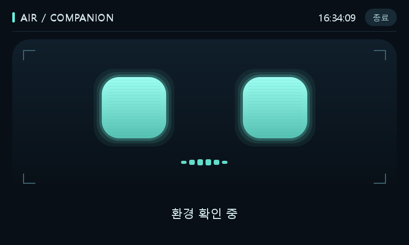
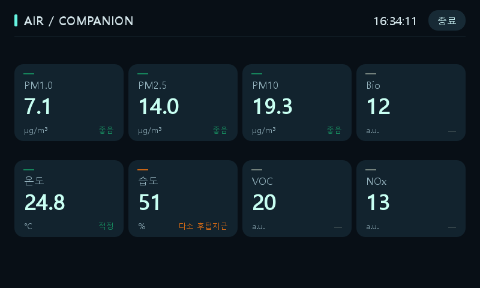

# Air Quality Robot Display — V2 UI Animation / WIP

800×480 Qt 화면에서 주변 환경을 로봇 표정과 8개 센서 카드로 표시하는 Python 프로젝트입니다. 실제 로봇 이동이나 공기청정 장비를 제어하지 않습니다.

## 주요 기능

- QPainter 로봇 얼굴과 Qt 센서 카드, 홈/상세 화면 전환
- PM1.0, PM2.5, PM10, VOC, NOx, Bioaerosol, 온도, 습도 표시
- PM 3종과 온습도의 항목별 최근 30초 이동평균, 최소 24개 sample, 후보 상태 10초 확인
- PM 급상승은 최근 5회 중 4회와 3초 지속 조건으로 빠르게 악화 반영
- 일부 센서값이 무효여도 정상 항목은 계속 분석하고, 전체 데이터가 충분할 때만 회복 확정
- 개별 센서가 5초 이상 무효이면 해당 센서만 다시 수집하고 로봇 얼굴은 마지막 확정 상태 유지
- 짧은 수신 오류 허용, stale 표시, worker 취소와 재연결
- VOC/NOx/Bio는 표시 전용이며 종합 표정에서 제외
- 데모 모드, 종료 처리, 중복 실행 방지, systemd watchdog 지원

상세 카드는 최신 수신값, 얼굴은 평균과 확정 결과를 표시합니다. 수신이 지연되면 카드 숫자는 마지막 정상값을 유지하되 카드 상태 문구와 색상이 `수신 지연`으로 바뀌며, 새 정상값이 들어오면 자동으로 복구됩니다. 센서 대기 중 상세 진입은 차단됩니다. `MONITORING` 이후에는 로봇 홈 영역을 터치해 상세 화면으로 이동할 수 있습니다. 상세 화면은 읽기 전용이며 화면을 다시 터치하거나 설정 시간이 지나면 얼굴 화면으로 복귀합니다. 로봇 홈에는 확정 상태 제목만 표시하며 후보 확인·수신 지연·원인 정보는 내부 분석 상태로만 유지합니다. 공식 AQI나 건강 안전 판정이 아닙니다. 판정 근거는 [SENSOR_CRITERIA.md](SENSOR_CRITERIA.md)를 참고하세요.

## 기술 스택

Python, PySide6(Windows 개발), PySide2/Qt 5(기존 Raspberry Pi 환경), QPainter, pySerial, unittest.

### V1 화면 호환성 보완

Pi의 Qt 5와 Windows Qt 6에서 헤더·상세·홈·종료 화면 및 바깥 여백을 어두운 배경으로 명시합니다. 각 컨테이너에 `WA_StyledBackground`를 적용했습니다. 헤더의 DEMO/연결 알림은 숨겼습니다. 로봇 홈은 얼굴 아래 상태 제목만 표시하고, 상세 화면은 별도 제목·갱신 경과시간·수신 지연·안내 문구 없이 8개 센서 카드만 표시합니다. 터치 후 얼굴에 남던 버튼 포커스 테두리도 제거했습니다. 분석 및 통신 기준은 변경하지 않았습니다. 배포 시 `dashboard.py`, `robot_ui.py`, `robot_led.py`, `sensor_data.py`, `app_config.ini`를 함께 복사하세요. 실제 Pi 렌더링은 재확인이 필요합니다.

### UI 설정

최초 실행의 분석 준비는 30초 수집·최소 24개 표본과 10초 상태 확인을 사용합니다. 통신 복구 후에는 단절 이전 표본을 버리고 10초 수집·최소 8개 표본과 5초 확인으로 다시 판정합니다. 복구 판정 후에는 기존 30초 이동평균으로 돌아갑니다. PM 급상승 감지는 계속 적용하며, 일부 항목이 부족하면 상태 개선을 확정하지 않습니다.

통신 단절 시 마지막 숫자는 `수신 지연` 표시와 함께 유지합니다. 마지막 확정 표정은 마지막 정상 수신부터 30초 미만 동안 유지하고, 그 이후에는 `센서 확인 중`으로 전환합니다. 센서 카드 화면을 보고 있을 때도 이 시간이 지나면 로봇 홈으로 자동 복귀하며, 정상 수신이 돌아와도 상세 화면을 자동으로 다시 열지 않습니다. 30초 이내에 복구되면 보고 있던 페이지는 유지하고, 상세 화면 자체의 자동 복귀 타이머는 별도로 적용됩니다. 강제 복귀 시 상세 타이머는 정지하고, 사용자가 상세 화면을 다시 열면 설정한 시간부터 새로 시작합니다. 이 시간과 재연결 분석 기준은 `sensor_data.py`의 `DISCONNECT_FACE_HOLD_SEC`, `RECONNECT_WINDOW_SEC`, `RECONNECT_MIN_SAMPLES`, `RECONNECT_CONFIRM_SEC`에서 조정합니다. Pi 자체가 재부팅되면 최초 실행 기준을 적용합니다.

센서 상세 화면의 자동 복귀 시간은 `app_config.ini`에서 초 단위로 변경합니다. 설정은 프로그램을 다시 시작할 때 적용됩니다. 현재 기본 설정은 30초입니다. 파일이 없거나, INI 문법이 잘못됐거나, 값을 읽을 수 없거나, 값이 0 이하이거나, 무한대 또는 Qt 타이머 범위를 넘는 값이면 5초를 사용합니다.

```ini
[ui]
sensor_detail_timeout_sec = 30
```

### V2 얼굴 애니메이션

V1의 센서 통신과 환경 판정은 유지하면서 QPainter 얼굴에 상태별 움직임을 추가했습니다. `robot_animation.py`는 경과시간에 따른 눈 위치, 눈 개방 정도, 입 파형과 상태 기호만 계산하고, `robot_ui.py`가 하나의 75ms Qt 타이머로 화면을 다시 그립니다. 얼굴 화면이 숨겨지면 해당 타이머도 정지합니다.

- `waiting`: 입 파형이 오른쪽으로 흐름
- `monitoring`: 눈이 좌우로 주변을 탐색
- `normal`: 일정 간격으로 눈을 깜빡임
- `detected`: 느낌표가 점멸
- `comfortable`: 눈이 위아래로 미세하게 이동
- `moving`: 방향 화살표와 시선이 좌우로 전환
- `purifying`: 좌우 가장자리의 가로 공기 물결이 얼굴 쪽으로 번갈아 흐르고 입 파형이 움직임

`moving`과 `purifying`은 표시 상태일 뿐 실제 이동이나 공기청정 장비를 제어하지 않습니다. `PURIFYING`은 향후 외부 상태 입력을 받을 수 있도록 표시용 API만 제공하며 현재 통신 프로토콜은 구현하지 않았습니다.

각 애니메이션 프레임은 얼굴 영역을 먼저 초기화한 뒤 다시 그립니다. `detected`의 눈과 glow는 모두 원형으로 렌더링해 `normal`에서 전환할 때 사각 눈 모양이 잔상처럼 보이지 않도록 했습니다.

## 데모 실행

Windows PowerShell:

```powershell
python -m venv .venv
.\.venv\Scripts\python.exe -m pip install -r requirements.txt
.\.venv\Scripts\python.exe main.py --demo --windowed
```

센서 판정 대기 없이 7개 얼굴 상태와 애니메이션을 4초마다 순서대로 확인하려면 다음 명령을 사용합니다. `NORMAL` 다음에 `DETECTED`가 나오므로 상태 전환 잔상도 확인할 수 있습니다.

```powershell
.\.venv\Scripts\python.exe main.py --demo-states --windowed
```

부분 센서 오류와 PM 빠른 악화 로직은 다음 데모로 확인합니다.

```powershell
# 습도 카드만 '값 확인', 나머지 센서 분석은 계속
.\.venv\Scripts\python.exe main.py --demo-partial --windowed

# 초기 상태 확정 후 PM2.5가 5초 동안 100 µg/m³로 상승
.\.venv\Scripts\python.exe main.py --demo-pm-rise --windowed
```

`--demo-pm-rise`는 최초 상태가 확정될 시간을 확보한 뒤 42번째 정상 수신부터 PM2.5 급상승을 발생시키며, 60회 주기로 반복합니다. `--demo-partial`은 통신 자체는 정상으로 유지하면서 습도값만 무효로 반환합니다.

모든 주요 변화와 오류 복구를 한 번에 확인하려면 통합 데모를 실행합니다.

```powershell
.\.venv\Scripts\python.exe main.py --demo-tour --windowed
```

`--demo-tour`는 약 2분 30초 주기로 다음 순서를 반복합니다.

| 수신 시도 | 데모 상황 | 예상 화면 |
|---:|---|---|
| 1~41 | 정상 수집·최초 확정 | `환경 확인 중`에서 확정 상태로 전환 |
| 42~46 | PM2.5 100 µg/m³ | 빠르게 `환경 개선이 필요해요`로 전환 |
| 47~51 | 정상값 | 30초 평균과 10초 확인으로 회복 시작 |
| 52~57 | 습도만 무효 | `값 확인` 후 5초부터 `센서 확인 중`, 로봇 얼굴 유지 |
| 58~87 | 습도 정상 복구·재수집 | 습도 카드 `데이터 보충 중`, 다른 분석과 로봇 얼굴 유지 |
| 88~90 | 습도 재수집 완료·여유 확인 | 습도가 종합 판정에 다시 참여하고 일반 카드 상태 유지 |
| 91~93 | 분석 대상 5개 모두 무효 | 세 번째 실패에서 전체 `센서 확인 중` |
| 94 | 통신 timeout | 카드에 `수신 지연`, 자동 재시도 |
| 95 | 포트 없음 | 자동 재시도, 이전 확정 표정은 마지막 정상 수신부터 30초 미만 유지 |
| 96~145 | 정상값 | 단절 이전 표본을 버리고 재연결용 새 표본 수집과 상태 복구 |

Raspberry Pi/Linux에서는 같은 옵션을 `python3 main.py --demo-states --windowed` 형식으로 실행합니다. 전체화면 확인 시 `--windowed`를 생략합니다. 전체화면에서는 터치 디스플레이 위에 마우스 포인터가 남지 않도록 커서를 숨기며, `--windowed` 실행에서는 개발과 점검을 위해 커서를 계속 표시합니다.

공개본에는 실제 센서 프로토콜과 통신 값이 없습니다. 먼저 `--demo`로 실행하세요. 전체화면은 `--windowed`를 생략합니다. Linux에서는 해당 환경의 PySide2 또는 PySide6와 pySerial을 별도로 준비하세요. 기존 Raspberry Pi의 Python 3.7/PySide2 호환을 고려하지만 장비에서 직접 검증해야 합니다.

## 로컬 전용 센서 설정

없는 파일만 생성하고 기존 장비 설정은 덮어쓰지 않습니다.

```powershell
if (!(Test-Path sensor_protocol.py)) { Copy-Item sensor_protocol_template.py sensor_protocol.py }
if (!(Test-Path sensor_connection_local.py)) { Copy-Item sensor_connection_example.py sensor_connection_local.py }
```

- `sensor_protocol.py`: 실제 장비에 대해 승인된 로컬 구현을 넣습니다. 공개 예제는 함수/예외 인터페이스만 제공하며 패킷을 생성하거나 전송하지 않습니다. placeholder 값만 채워도 완성되는 구현이 아닙니다.
- `sensor_connection_local.py`: 실제 baudrate, 데이터 비트, 패리티, 정지 비트 등 장비 설정을 로컬에서 입력합니다.
- 실제 register address, slave/device ID, 요청/응답과 매핑 정보는 공개 저장소에 포함되지 않습니다.
- 기존 장비의 두 로컬 파일은 유지하세요. 배포 시 공유 코드와 로컬 설정이 함께 필요합니다. Git clone/pull만으로 비공개 파일이 복원되지는 않습니다.
- `read_sensor_data(ser, cancel_event=None)`는 정상 프레임 전체 검증 후 센서 key의 dict를 반환해야 합니다. CRC/프레임 오류를 부분 성공으로 처리하지 않습니다.

### 2026-09-29 분석 변경 Raspberry Pi 배포

오늘 변경한 실제 분석 동작을 Raspberry Pi에 적용하려면 다음 세 파일을 함께 복사해야 합니다.

- `air_quality_analyzer.py`: 항목별 이동평균, PM 빠른 악화, 부분 오류 처리
- `sensor_status.py`: PM·온도·습도의 절대 유효 범위
- `sensor_data.py`: 빠른 악화 설정값과 데모 시나리오

새 `--demo-partial`, `--demo-pm-rise` 실행 옵션도 Raspberry Pi에서 사용하려면 `main.py`를 추가로 복사합니다. `tests/check_demo.py`와 테스트 파일은 검증용이므로 운영 실행에는 필요하지 않습니다. 장비 고유의 `sensor_protocol.py`, `sensor_connection_local.py`는 덮어쓰지 않으며, 로컬 UI 설정을 유지하려면 `app_config.ini`도 기존 파일을 유지합니다.

## 검사

위 예제 복사 후 센서 없이 실행할 수 있습니다.

```powershell
.\.venv\Scripts\python.exe -m unittest discover -s tests -p "test_*.py"
.\.venv\Scripts\python.exe tests\check_demo.py
```

테스트는 가짜 포트/데이터와 offscreen Qt를 사용합니다. 실제 장비 전용 패킷 테스트는 공개하지 않습니다. `tests/check_demo.py`는 `demo_images/`에 미리보기 PNG를 생성합니다.

README에 사용하는 현재 런타임 UI 이미지는 다음 명령으로 다시 생성합니다. `preview_robot.py`는 별도의 목업을 그리지 않고 실제 `MainWindow`, 로봇 홈 위젯, 센서 카드 위젯을 캡처합니다. 홈 이미지는 `MONITORING / 환경 확인 중` 상태로 고정됩니다.

```powershell
.\.venv\Scripts\python.exe preview_robot.py
```

- `demo_images/demo_robot_home.png`: MONITORING 로봇 홈 화면
- `demo_images/demo_preview.png`: 고정 예시값을 표시한 8개 센서 카드 화면

## 유지보수 이력

### 2026-09-17 · V1 공개 저장소 구성

문제 파악: 센서 디스플레이를 공개 저장소로 관리하면서 실제 장비의 프로토콜·register 주소·장치 ID·시리얼 설정이 공유 코드에 포함되지 않도록 분리할 필요가 있었습니다. 프레임 오류와 개별 측정값 오류도 구분해야 했습니다.

방법 논의: 공개 UI·분석 코드와 장비 전용 구현을 분리하고, 공개 템플릿에는 동일한 함수·예외 인터페이스를 제공하는 접근을 선택했습니다. 잘못된 프레임의 일부 값만 사용하는 방식은 허용하지 않기로 했습니다.

해결 방법: 800×480 Qt 화면, 8개 센서 카드와 V1 분석 로직을 공개 저장소로 구성했습니다. 실제 프로토콜과 시리얼 설정은 로컬 전용 파일로 분리해 Git 추적에서 제외했습니다. `sensor_protocol_template.py`, `sensor_connection_example.py`로 인터페이스를 맞추고, CRC·프레임 오류는 전체 응답 실패, 정상 프레임 내부의 무효값은 항목별 오류로 처리하도록 검증했습니다.

### 2026-09-18 · Raspberry Pi 화면 보완과 V2 애니메이션

문제 파악: Raspberry Pi의 PySide2/Qt 5에서 헤더·하단에 흰 여백이 보였고, 얼굴 상태가 바뀔 때 이전 눈 모양이 잔상으로 남는 문제가 있었습니다. 센서 입력을 기다리지 않고 모든 표정을 검증할 방법도 필요했습니다.

방법 논의: 플랫폼 기본 배경에 의존하지 않고 화면 배경·높이를 명시하며, 얼굴은 매 프레임 전체를 초기화한 뒤 다시 그리는 접근을 선택했습니다. 애니메이션 계산과 Qt 렌더링을 분리해 독립적으로 검사할 수 있도록 했습니다.

해결 방법: 컨테이너 배경과 페이지 높이를 조정해 Windows와 Pi의 800×480 구성을 보완했습니다. `robot_animation.py`에 waiting, monitoring, normal, detected, comfortable, moving, purifying의 7개 상태를 구현하고, 얼굴 영역을 지운 뒤 그려 잔상을 제거했습니다. `--demo-states`로 모든 상태와 전환을 순서대로 확인하도록 구성했습니다.

### 2026-09-21 · 터치 동작과 상세 화면 정리

문제 파악: 홈과 상세 화면의 이동·복귀 규칙을 명확히 하고, 불필요한 안내·원인·갱신 라벨을 줄일 필요가 있었습니다. 센서 수신 처리 때문에 사용자가 보고 있는 페이지가 바뀌지 않도록 할 필요도 있었습니다.

방법 논의: 홈 전체를 터치 대상으로 사용하고, 상세는 읽기 전용 화면으로 두어 전체 터치 또는 타이머로 복귀하는 접근을 선택했습니다. 수신 상태와 페이지 선택은 분리하고, 복귀 시간은 코드 대신 설정 파일에서 관리하기로 했습니다.

해결 방법: 홈 터치로 상세를 열고 상세 터치·타이머로 복귀하도록 구성했습니다. 별도 복귀 버튼을 제거하고 SENSOR_CHECK/WAITING 중에는 상세 진입을 차단했습니다. 홈에는 상태 제목, 상세에는 8개 센서 카드를 중심으로 표시하며 `app_config.ini`의 `sensor_detail_timeout_sec`로 복귀 시간을 분리했습니다. 당시 혼재한 press/release 처리의 후속 보완은 아래 2026-10-01 터치 점검 항목에 기록했습니다.

### 2026-09-22 · 설정 복구, 상태 가시성 및 미리보기 안정화

문제 파악: 터치 후 포커스 테두리와 hover 설명이 남거나 나타났고, 미리보기와 실제 UI가 다르거나 애니메이션 시점에 따라 PNG가 달라지는 문제가 있었습니다. 잘못된 설정 파일로 실행이 중단될 위험과 수신 지연 표시의 일관성도 점검했습니다.

방법 논의: 터치 제품에 불필요한 포커스·hover 표시를 줄이되 접근성 이름은 유지하고, 미리보기는 실제 위젯을 고정된 상태·시각으로 캡처하는 접근을 선택했습니다. 설정 오류는 기본값으로 복구하고 지연 상태는 카드 내부에서 표시하기로 했습니다.

해결 방법: 얼굴 포커스 테두리와 카드 hover 설명을 제거하고 접근성 이름을 유지했습니다. `preview_robot.py`를 실제 런타임 위젯 캡처로 바꾸고 홈 상태와 애니메이션 시각을 고정했습니다. 설정 문법·인코딩·읽기·숫자 오류 및 0 이하 값은 5초 기본값으로 복구하도록 했습니다. 카드에 `수신 지연`을 표시하고 정상 수신 시 기존 판정으로 복구하며, Pi 확인 결과에 맞춰 애니메이션 주기를 75ms로 통일했습니다. 당시 테스트 90개와 offscreen 데모 검사를 통과했습니다.

### 2026-09-29 · 분석 유효성 및 급상승 대응

문제 파악: 명백한 무효값이 평균에 섞이는 위험, 30초 평균 때문에 PM 급상승 반영이 늦어지는 문제, 일부 항목 누락을 환경 개선으로 오판할 가능성이 있었습니다.

방법 논의: 표시 등급과 절대 유효 범위를 구분하고, 정상 항목의 분석을 유지하면서 부족한 데이터로 개선을 확정하지 않는 접근을 선택했습니다. PM 악화에는 별도 빠른 경로를 두되 단발성 튐은 제외하기로 했습니다.

해결 방법: 제조사 범위가 확정되기 전의 보수적인 검증 범위로 PM 0~5000 µg/m³, 온도 -50~100°C, 습도 0~100%를 적용했습니다. 같은 PM이 최근 5회 중 4회 이상 더 나쁜 단계이고 최초 상승부터 3초 이상이면 빠르게 악화를 확정합니다. 일부 무효값은 해당 표본만 제외하고 정상 항목의 분석을 계속하며, 항목이 부족하면 상태 개선을 확정하지 않습니다. `--demo-tour`에 정상 수집·급상승·부분/전체 오류·timeout·포트 없음·복구를 포함했고 당시 전체 테스트 116개를 통과했습니다.

### 2026-10-01 · Raspberry Pi 표시와 설정 안정성 보완

문제 파악: 상세 시간에 `inf` 또는 Qt 타이머 범위를 넘는 숫자를 입력하면 설정 읽기를 통과해도 화면 진입 시 예외가 발생할 수 있었습니다. 고정 터치 디스플레이에 마우스 커서가 남는 점과 플랫폼별 의존성 설치 안내도 보완할 필요가 있었습니다. 모서리 프레임의 시각적 필요성은 결함이 아닌 디자인 선택으로 검토했습니다.

방법 논의: 설정값을 UI에 전달하기 전에 유한성과 타이머 범위를 검증하고, 전체화면에만 빈 커서를 적용하는 접근을 선택했습니다. 디자인은 프레임 유무를 비교한 뒤 기존 프레임을 유지했으며, 상세 자동 복귀 시간은 시험용 30초로 조정했습니다. 운영 시간은 별도 설정할 수 있도록 유지했습니다.

해결 방법: 잘못된 시간은 5초 기본값으로 복구하도록 검증을 강화했습니다. `main.py`에서 전체화면 커서를 숨기고 `--windowed`에서는 표시합니다. 프레임은 옵션으로 분리하고 `designs/render_preview_compare.py`, `demo_images/preview_compare.png`를 추가했으며 런타임 기본값은 표시로 유지했습니다. `requirements.txt`에 Windows PySide6와 Pi Buster의 apt PySide2·pySerial 설치 범위를 구분했습니다. 당시 전체 테스트 116개, 데모 통합 검사, 문법 컴파일과 Git diff 검사를 통과했습니다.

이 항목의 변경을 Raspberry Pi에 반영할 때는 `main.py`, `sensor_data.py`, `app_config.ini`를 복사합니다. 얼굴 프레임 옵션과 분석 코드 문서화 변경까지 동일하게 맞추려면 `robot_ui.py`, `air_quality_analyzer.py`도 함께 복사합니다. `tests/`, `designs/`, `demo_images/`는 운영 실행에 필요하지 않으며 장비 고유의 `sensor_protocol.py`, `sensor_connection_local.py`는 유지합니다. 후속 재연결 변경의 전체 배포 파일은 아래 추가 점검 항목을 참고하세요.

### 2026-10-01 · 추가 점검과 재연결 정책 변경

#### 1. 상세 카드 가독성

문제 파악: 센서명·단위·미확정 표시의 대비가 약하고, 긴 상태 문구를 넣는 영역이 좁았습니다. 작은 Pi 패널에서는 폰트와 시야각에 따라 읽기 어려울 가능성이 있었습니다.

방법 논의: 화면 구성 변경과 복귀 버튼 추가도 비교했지만, 제품의 디스플레이 역할을 고려해 기존 배치와 모서리 프레임을 유지하고 가독성만 조정하기로 했습니다.

해결 방법: `robot_ui.py`에서 센서명·단위 대비와 상태 영역 폭을 조정하고, `dashboard.py`에서 상태 글자를 13px에서 14px로 확대했습니다. `sensor_status.py`의 미확정 색상도 밝게 조정했습니다. 실제 Pi에서는 색상 차이가 크지 않다는 사용자 피드백이 있어 개선 효과를 과장하지 않습니다.

#### 2. 터치 시점과 페이지 전환의 간섭

문제 파악: Pi에서 로봇과 센서 카드가 반복 전환되는 현상이 보고됐습니다. 사용자는 화면의 먼지에 의한 입력 가능성을 확인했습니다. 코드에는 홈의 release 처리, 상세의 press 처리, 얼굴 버튼의 clicked 처리가 혼재해 있었습니다. 반복 전환의 직접 원인을 코드만으로 확정하지는 않았습니다.

방법 논의: 반복 가짜 입력과 한 접촉의 press/release가 서로 다른 페이지에서 처리되는 위험을 구분했습니다. 홈의 배경 처리만 바꾸면 얼굴 버튼의 release 경로가 남으므로 버튼까지 점검했습니다.

해결 방법: 홈 배경·제목·얼굴 버튼과 상세 화면의 터치 전환을 press 기준으로 통일했습니다. 얼굴 버튼에는 이벤트 필터를 적용했습니다. 페이지 전환 후 release가 도착해도 다시 진입하지 않는지, 홈이 숨겨지면 애니메이션 타이머가 정지하고 복귀 시 재시작하는지 테스트했습니다. 반복적인 가짜 press 입력 자체를 차단하는 기능은 아닙니다.

#### 3. 통신 실패와 포트 탐색

문제 파악: 모든 센서값이 무효인 응답을 정상 포트로 확정해 다른 후보 탐색을 멈추는 결함을 테스트로 재현했습니다. 별도로 Pi 로그에서 USB 분리 후 내장 UART `/dev/ttyAMA0`를 시도하다 write timeout이 발생하고 정상 수신 복구가 늦어지는 것을 확인했습니다.

방법 논의: 일부 값만 무효인 정상 프레임은 연결을 유지하되, 전체 무효 응답은 실패로 취급하기로 했습니다. 이 장비는 USB로 연결되는 센서 모듈 하나이므로 내장 UART 탐색을 제외하기로 했습니다.

해결 방법: `serial_source.py`에서 8개 값이 모두 무효이면 수신 실패로 처리합니다. `port_discovery.py`의 Linux 후보를 `/dev/ttyUSB*`, `/dev/ttyACM*`로 제한해 `/dev/ttyAMA0`, `/dev/ttyS*`를 제외했습니다. Windows COM 포트 탐색은 유지합니다. 일부 값의 `None`만으로 모듈 재연결을 판단하지 않습니다.

#### 4. 재시작 예약·종료·카드 상태의 충돌

문제 파악: 통신 스레드가 멈춘 뒤 3초 재시작 대기 중 종료하면 종료 플래그가 설정되지 않아 닫힌 창에서 통신이 다시 시작될 수 있었습니다. 스레드가 예기치 않게 종료될 때 분석은 초기화되지만 카드에는 이전 정상 문구가 남는 문제도 재현했습니다.

방법 논의: 스레드의 실행 여부와 관계없이 창 종료는 이후 작업을 차단해야 하며, 분석과 카드의 통신 상태가 일치해야 한다고 판단했습니다.

해결 방법: `dashboard.py`에서 재시작 대기 중 종료에도 종료 상태를 설정하고 타이머를 정지합니다. 작업 스레드 복구 안내 시 마지막 숫자를 유지하면서 카드를 `수신 지연`으로 바꿉니다. 두 결함은 수정 전 실패와 수정 후 통과를 회귀 테스트로 확인했습니다.

#### 5. 최초 연결과 재연결의 분석 준비 시간

문제 파악: 기존에는 포트 없음 또는 5초 수신 공백으로 분석이 초기화되고, 짧은 USB 탈착 후에도 약 40초간 다시 환경을 확인했습니다. USB 후보만 탐색하도록 바꾼 후에는 포트 없음이 즉시 감지돼 이전 표정도 바로 사라졌습니다.

방법 논의: 디스플레이 전용 제품에서 짧은 단절마다 긴 준비 화면을 보여주는 것은 과도하다고 판단했습니다. 단, 마지막 표정의 표시와 새 판정에 사용하는 표본은 분리해야 하므로 이전 데이터를 새 분석에 섞는 방식은 채택하지 않았습니다.

해결 방법: 정상 수신 이력과 재연결 여부를 구분해 최초 실행은 30초 수집·최소 24개와 10초 확인, 재연결은 새 표본 10초 수집·최소 8개와 5초 확인을 적용했습니다. 마지막 확정 표정은 마지막 정상 수신부터 30초 미만 유지합니다. 재연결 판정 후 일반 30초 평균으로 복귀하며, PM 빠른 악화와 데이터 부족 시 개선 확정 차단을 유지합니다. Pi 재부팅은 최초 실행으로 처리합니다. 사용자는 Pi에서 30초 이상 단절과 30초 이내 재연결 동작을 확인했습니다.

#### 6. 장기 단절 중 센서 카드 강제 복귀

문제 파악: 정상 데이터가 장시간 들어오지 않는데도 상세 화면이 열려 있으면 오래된 숫자가 계속 중심 정보로 보일 수 있습니다. 표정 유지가 만료되는 시점과 페이지 전환 정책을 맞출 필요가 있었습니다.

방법 논의: 짧은 단절에는 사용자가 보고 있는 화면을 유지하고, 마지막 정상 수신 후 30초 이상 경과한 경우에만 홈으로 강제 복귀하기로 했습니다. 상세 자동 복귀 시간과 통신 단절 시간을 별도 기준으로 유지했습니다.

해결 방법: `dashboard.py`의 상태 점검에서 수신 공백이 `DISCONNECT_FACE_HOLD_SEC` 이상이고 상세 화면이 열려 있으면 로봇 홈으로 복귀합니다. 이때 상세 타이머를 정지하며, 정상 수신 복구만으로 상세 화면을 다시 열지 않습니다. 사용자가 상세 화면을 열면 타이머는 설정값부터 새로 시작합니다. 종료 화면은 이 전환 대상에서 제외됩니다.

#### 검증과 Raspberry Pi 배포

재연결 정책 반영 후 전체 테스트 126개를 통과했습니다. 이후 장기 단절 강제 복귀를 추가하고 관련 UI 테스트 12개를 통과했으며, 최종 커밋 전 전체 테스트 127개를 다시 실행해 통과했습니다. 공개 테스트가 비공개 프로토콜을 직접 요구하던 의존성도 정리했고, 비공개 파일이 없는 상황에서 관련 테스트 실행을 확인했습니다. PC 검증은 Windows PySide6와 가짜 포트·offscreen 이벤트를 사용하며, Pi Qt5 드라이버와 장시간 운용의 모든 문제를 배제하는 것은 아닙니다.

재연결 정책은 `air_quality_analyzer.py`, `dashboard.py`, `sensor_data.py`, `sensor_worker.py`, `serial_source.py`를 함께 배포합니다. USB 후보 제한은 `port_discovery.py`, 터치 처리 보완은 `robot_ui.py`에 있습니다. 이 파일들을 이미 배포한 장비에 장기 단절 강제 복귀만 추가하려면 `dashboard.py`만 복사하고 서비스를 재시작합니다. 장비 전용 프로토콜과 시리얼 설정은 보존합니다.

## Raspberry Pi 연속 운전 및 장애 복구 시험

아래 결과는 실제 Pi에서 수집한 기록과 사용자 시험 결과입니다. 이번 시험 파일의 장비 날짜는 모두 2026-09-23으로 기록되어 있으므로, 2026-10-01 코드 변경 이력과 동일한 버전을 시험했다고 단정하지 않습니다. 실행 환경은 Python 3.7.3 / PySide2 / Qt 5.11.3입니다. 검토한 시험 자료 6개는 `logs/`에 공개합니다. 로그의 장비 이름은 `device`, 사용자·프로젝트 경로는 `/home/user/app`으로 익명화했으며 시험 시각·PID·측정값·경고·복구 기록은 유지했습니다. 익명화 전 원본은 로컬 `backups/`에 보존하며 공개하지 않습니다. 새로운 로그는 기본적으로 Git에서 제외됩니다.

### 이전 연속 운전 기록

- `logs/demo_states_2hours_with_sensor.log`: 파일명은 2시간이지만 실제 기록은 2026-09-21 18:29:40~21:30:49, 약 3시간입니다. 기록된 프로세스는 PID 1073을 유지했고, CPU는 11.8~19.3%, RSS는 81,620~82,252KB였습니다. 이 자료만으로 서비스 재시작 횟수나 센서 정확도까지 확인한 것은 아닙니다.
- `logs/air-quality-health-20260923-004131.csv`: 장비 시각 2026-09-23 00:41:32~02:40:49의 약 2시간, 120개 기록에서 서비스 `active`, PID 1084를 유지했습니다. 온도는 44.8~51.1°C, 프로세스 CPU는 17.2~19.8%, 메모리 비율은 2.0%였습니다.
- `logs/air-quality-service-20260923-004539.log`: 위 실행의 초기 포트 탐색 중 write/receive timeout이 기록됐으며, 00:22:29에 `/dev/ttyUSB0` 센서 확인과 수신 복구가 기록됐습니다. 지속적인 통신 오류가 없었던 시험으로 해석하지 않습니다.

### 이번 연속 운전 및 통신 장애 시험

오전에는 별도 조작 없이 약 3시간 운전하고, 오후에는 약 2시간 동안 센서 모듈 분리·재연결을 5회 반복했습니다. 서비스 상태 출력상 10:19:45부터 약 6시간 동안 PID 1111을 유지했으며, 이후 자동 재시작 시험을 별도로 수행했습니다.

| 항목 | 오전: 10:21:49~13:21:13 | 오후: 14:25:09~16:24:25 |
|---|---|---|
| 서비스 상태 / 재시작 | 전체 `active/running` / 0회 | 전체 `active/running` / 0회 |
| PID | 1111 유지 | 1111 유지 |
| 프로그램 메모리 | 78.4→78.9MB, 이후 유지 | 78.9MB 유지 |
| 프로그램 CPU | 15.1~15.4% | 기록상 15.4% |
| 온도 | 41.9~53.1°C | 53.1~56.0°C, 평균 54.4°C |
| 스로틀 상태 | 전체 `throttled=0x0` | 전체 `throttled=0x0` |

자료: `logs/pi_monitor_20260923_102149.tsv`, `logs/pi_monitor_20260923_142509.tsv`, `logs/service_test_afternoon.log`.

| 회차 | 로그상 분리 감지 | 데이터 수신 복구 | 이전 표정 유지 |
|---|---|---|---|
| 1 | 14:50:22 | 14:50:49 | `True` |
| 2 | 15:15:23 | 15:16:08 | `False` |
| 3 | 15:40:24 | 15:40:42 | `True` |
| 4 | 16:05:28 | 16:06:16 | `False` |
| 5 | 16:15:28 | 16:16:10 | `False` |

5회 모두 포트 분리 감지, 재탐색, 센서 확인, 데이터 수신 복구가 기록됐습니다. 사용자 기록의 케이블 재연결 시각 대비 수신 복구까지 약 2~9초가 걸렸습니다. 30초 미만 수신 공백에서는 이전 표정을 유지하고, 그 이상에서는 유지하지 않는 정책과 일치했습니다. 모든 회차에서 재연결 전용 10초 수집·5초 판단 확인 절차에 진입했으며, 최종 표정 확정 시각 자체는 이 로그에 없습니다.

오후 `WARNING`은 의도적인 모듈 분리에 따른 `PortUnavailableError`이며 이후 모두 수신 복구로 이어졌습니다. 제공된 오후 로그에 처리되지 않은 예외나 프로그램 종료 기록은 없습니다. 오전 서비스 로그는 확인되지 않아 오전의 모든 오류 부재를 확정하지 않습니다.

### 강제종료 후 자동 재시작 시험

사용자가 메인 프로세스를 SIGKILL로 강제종료한 1회 시험에서 PID가 1111에서 31517로 변경됐고, `NRestarts`가 0에서 1로 증가했으며 `active/running`으로 복귀했습니다. 서비스는 16:48:43에 시작됐고, 16:48:44에 30초 watchdog 활성화 및 `/dev/ttyUSB0` 센서 확인이 기록됐습니다. 근거는 사용자 제공 터미널 출력이며 원본 로그 파일에는 포함되지 않습니다. 강제종료 시각이 없어 재시작 소요 시간은 산출하지 않습니다. 이 시험은 watchdog 신호 누락에 따른 재시작을 별도로 검증한 것은 아닙니다.

시험 범위 내에서 연속 실행, 반복 통신 장애 후 수신 복구, 강제종료 후 자동 재시작은 양호했습니다. 프로그램 메모리의 지속 증가나 스로틀 이상은 관측되지 않았습니다. 약 1분 간격의 상태 기록으로 순간적인 CPU 부하·멈춤을 모두 배제할 수는 없으며, 최종 화면·표정 복구와 수일 단위 운전 안정성은 별도 검증 범위입니다.

## 공개 범위와 현재 상태

`.gitignore`는 검토한 파일만 공개하는 allowlist입니다. 새 파일을 추가할 때 공개 여부를 검토해야 합니다. 실제 protocol/config, .env, IDE/캐시, 백업 ZIP, 미검토 장비 로그, 대화/인계 문서와 이전 제어 프로그램은 제외됩니다. `logs/`의 검토한 익명화 시험 자료 6개만 예외로 포함합니다. `git add -f`로 제외 파일을 추가하지 마세요.

**V2 UI Animation / WIP.** 센서 분석은 유효 범위, PM 빠른 악화, 항목별 부분 표본 정책을 적용했습니다. 실제 센서의 정확한 제조사 측정 범위·음수 온도 인코딩·무효 코드, Pi의 응답 주기/timeout/터치/폰트·애니메이션 성능과 복구 동작은 장비에서 추가 확인해야 합니다. 외부 이동/정화 통신 규격과 장비 제어는 구현하지 않았습니다.



