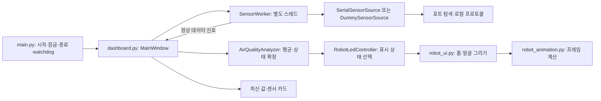

# 코드 구조와 수정 위치

정리 기준: 2026-10-07. 운영 안내는 [HANDOVER.md](HANDOVER.md)를 참고합니다.

## 데이터와 화면 흐름

통신은 worker에서 수행하고 UI 변경은 Qt 신호를 통해 GUI 스레드에서 처리합니다. worker가 사용하는 실제 프로토콜과 연결 설정은 별도 비공개 파일입니다. 카드 숫자는 최신 정상 수신값이고 로봇 표정은 평균·확정 상태이므로 두 표시가 즉시 같은 방향으로 변하지 않을 수 있습니다.

## 파일별 책임

| 파일·디렉토리 | 책임 / 수정할 때 볼 곳 |
|---|---|
| `main.py` | 실행 옵션, 단일 실행 잠금, Qt 시작, SIGTERM/SIGINT 정상 종료 |
| `dashboard.py` | 홈/상세 페이지, 요청 주기, 수신·실패 처리, 재연결 시작, 강제 복귀, worker 종료 |
| `sensor_data.py` | 분석·재연결 상수, INI 읽기, 데이터 소스 선택, 더미 시나리오 |
| `app_config.ini` | 상세 화면 자동 복귀 시간 |
| `sensor_worker.py` | worker 취소·신호, 수신 실패 처리와 요약 로그 연결 |
| `serial_source.py` | 포트 열기·센서 검증·수신·실패 후 재탐색, 키 변환 |
| `port_discovery.py` | OS별 후보 포트 선택; UI 복귀 시간은 여기서 정하지 않음 |
| `sensor_protocol.py` / `sensor_connection_local.py` | 실제 프레임 처리·연결 설정; 비공개, 운영값 보존 |
| `sensor_protocol_template.py` / `sensor_connection_example.py` | 공개 인터페이스·미설정 예제; 실제 통신 구현 아님 |
| `sensor_status.py` | 센서 값 유효성, 카드 등급, 종합 상태 매핑 함수 |
| `air_quality_analyzer.py` | 표본창, 항목별 준비, 평균, 후보 확인, PM 급상승, 전체·부분 오류, 재연결 분석 |
| `robot_led.py` | `RobotDisplayState`, 종합 판단에서 표시 상태·제목 선택 |
| `robot_ui.py` | QPainter 얼굴, 홈·센서 카드 위젯, 터치 동작·스타일 |
| `robot_animation.py` | 표정별 애니메이션 수치; 센서 판단은 하지 않음 |
| `widgets.py` | 기타 공통 UI 위젯 |
| `qt_compat.py` | PySide2/PySide6 선택과 공통 Qt API |
| `service_watchdog.py` | systemd 환경이 있을 때 heartbeat 전송, 작업 정리 정체 시 전송 중단 |
| `single_instance.py` | 사용자 홈 잠금; 수동 실행·서비스·복사본 사이 중복 방지 |
| `repeated_error_log.py` | 동일 오류 반복 기록 요약 |
| `previews/` / `previews/images/` | 미리보기 생성 코드 / PNG; 현재 런타임 필수 자원 아님 |
| `tests/` | 가짜 포트·데이터 및 offscreen Qt 검증 |
| `logs/` | 개별 검토·익명화한 공개 시험 자료 6개 |

`robot_led.py`에는 `LegacyRasterRobotHomeWidget`도 남아 있지만 현재 홈은 `RobotHomeWidget`을 사용합니다. 기존 raster 클래스나 `designs/`의 이미지 경로를 보고 현재 운영에 PNG가 필수라고 판단하지 않습니다.

## 분석과 표시 상태

분석 대상은 PM1.0, PM2.5, PM10, Temperature, Humidity입니다. 준비된 항목의 상태 중 가장 나쁜 상태가 종합 후보가 됩니다. 일부 항목이 부족하면 정상 항목 분석은 계속하지만 부족한 정보로 상태 개선을 확정하지 않습니다. VOC/NOx/Bio는 카드 표시 전용입니다. 유효 범위·등급은 [SENSOR_CRITERIA.md](../SENSOR_CRITERIA.md)를 참고합니다.

| 표시 상태 | 기본 의미 |
|---|---|
| `waiting` | 센서 확인 중 |
| `monitoring` | 환경 판단 준비 중 |
| `comfortable` | 확정된 쾌적 상태 |
| `normal` | 확정된 보통 상태 |
| `detected` | 확정된 개선 필요 상태 |
| `moving` / `purifying` | 향후 외부 상태 입력을 위한 표시 상태; 실제 제어 기능 없음 |

PM 급상승은 최근 5표본 중 4표본과 3초 지속 조건으로 더 나쁜 상태를 빠르게 확정할 수 있습니다. 일반 수집·확정, 재연결 수집·확정, 단절 중 표정 유지, 상세 복귀는 별도 조건입니다. 한 타이머 변경으로 다른 조건까지 바뀐다고 가정하지 않습니다.

## 요청별 수정 시작점

| 요청 | 먼저 확인할 파일 | 함께 검토할 영향 |
|---|---|---|
| 표정 모양·움직임 변경 | `robot_ui.py`, `robot_animation.py` | 미리보기, 터치 범위, Qt5 렌더링 |
| 상태 이름·설명 변경 | `robot_led.py` | 카드 문구·접근성·테스트 |
| 센서 등급 변경 | `sensor_status.py` | 종합 매핑, 기준 문서, 경계값 테스트 |
| 표정 판단 대상 변경 | `air_quality_analyzer.py` | 전체·부분 준비 조건·복구·후보 확인·PM 급상승 |
| 상세 복귀 시간 변경 | `app_config.ini` | 단절 30초 기준과 독립임을 유지 |
| 통신 후보·재시도 변경 | `port_discovery.py`, `serial_source.py`, `dashboard.py` | 실패 복구·worker 취소·watchdog |
| 재연결 판단 시간 변경 | `sensor_data.py`, `air_quality_analyzer.py` | 최소 표본·표정 유지·상태 개선 조건 |

디자인 변경을 이유로 센서 판단 기준을 함께 바꾸지 않습니다. 판단 로직을 바꾸는 경우에는 정상·경계값·부분 무효·전체 단절·짧은/긴 재연결을 함께 검토합니다.
